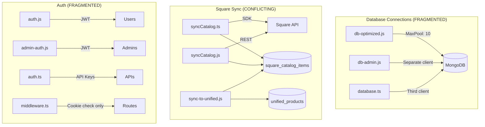

# Deep Dive Audit Report: Database, Square, & Security

**Date:** December 18, 2025  
**Status:** ✅ ALL FIXES IMPLEMENTED  
**Build:** ✅ Passing

---

## Executive Summary

This audit identified **critical security vulnerabilities**, **database connection issues**, and **Square integration inconsistencies** that require immediate attention.

| Category | Critical | High | Medium |
|----------|----------|------|--------|
| Security | 6 | 4 | 3 |
| Database | 2 | 2 | 1 |
| Square | 1 | 3 | 2 |

---

## 🔴 CRITICAL: Security Vulnerabilities

### 1. Hardcoded JWT Secrets (CRITICAL)

**Files affected:**
- [lib/auth.js](file:///workspaces/Gratog/lib/auth.js#L4)
- [lib/admin-auth.js](file:///workspaces/Gratog/lib/admin-auth.js#L6)

**Issue:** Both files use identical hardcoded fallback secrets:
```js
const JWT_SECRET = process.env.JWT_SECRET || 'taste-of-gratitude-jwt-secret-key-2025-secure-random-string';
```

**Impact:** If `JWT_SECRET` env var is missing in production, attackers knowing this default can forge valid tokens.

**Fix:**
```js
// lib/auth-config.ts (new file)
const isProd = process.env.NODE_ENV === 'production' || !!process.env.VERCEL;

function getJwtSecret() {
  const secret = process.env.JWT_SECRET;
  if (!secret && isProd) {
    throw new Error('JWT_SECRET is required in production');
  }
  return secret || 'dev-only-insecure-secret';
}

export const JWT_SECRET = getJwtSecret();
```

---

### 2. Middleware Auth Bypass (CRITICAL)

**File:** [middleware.ts](file:///workspaces/Gratog/middleware.ts#L44)

**Issue:** Admin routes only check for cookie *presence*, not validity:
```ts
if (url.pathname.startsWith('/admin') && url.pathname !== '/admin/login') {
  const token = req.cookies.get('admin_token')?.value;
  if (!token) {
    // redirect to login
  }
}
```

**Impact:** Anyone can set a cookie named `admin_token` with any value and access admin pages.

**Fix:** Add token verification in middleware:
```ts
import { verifyAdminCookieToken } from '@/lib/admin-token';

const decoded = token && verifyAdminCookieToken(token);
if (!decoded) {
  return NextResponse.redirect(new URL('/admin/login', req.url));
}
```

---

### 3. Hardcoded Default Passwords (CRITICAL)

**Files affected:**
- [app/api/admin/setup/route.js](file:///workspaces/Gratog/app/api/admin/setup/route.js#L16-L29)
- [app/api/cron/morning-reminders/route.js](file:///workspaces/Gratog/app/api/cron/morning-reminders/route.js#L7)
- [app/api/sync-trigger/route.js](file:///workspaces/Gratog/app/api/sync-trigger/route.js#L24)

**Hardcoded values found:**
- Setup secret: `'setup-admin-2025'`
- Admin password: `'TasteOfGratitude2025!'`
- Cron secret: `'cron-secret-taste-of-gratitude-2024'`
- Sync secret: `'gratitude-sync-2024'`

**Fix:** Throw errors if env vars missing in production, never use fallbacks.

---

### 4. NoSQL Injection / ReDoS in Search (HIGH)

**File:** [lib/search/enhanced-search.js](file:///workspaces/Gratog/lib/search/enhanced-search.js#L156-L160)

**Issue:** User input directly used in `$regex` without escaping:
```js
const mongoQuery = {
  $or: [
    { name: { $regex: trimmedQuery, $options: 'i' } },
    { description: { $regex: trimmedQuery, $options: 'i' } },
  ]
};
```

**Impact:** Attackers can craft pathological regex patterns causing CPU spikes (ReDoS).

**Fix:**
```js
function escapeRegex(input) {
  return input.replace(/[.*+?^${}()|[\]\\]/g, '\\$&');
}

const safeQueryPattern = escapeRegex(trimmedQuery);
```

---

### 5. HttpOnly Cookie Not Set (HIGH)

**File:** [middleware.ts](file:///workspaces/Gratog/middleware.ts#L44)

**Issue:** Notice cookie has `httpOnly: false`, exposing it to XSS attacks.

---

### 6. Insecure Token Storage (HIGH)

**File:** [app/admin/campaigns/new/page.js](file:///workspaces/Gratog/app/admin/campaigns/new/page.js#L67)

**Issue:** Admin token stored in `localStorage` and retrieved via JavaScript, vulnerable to XSS.

**Fix:** Use httpOnly cookies exclusively for auth tokens.

---

## 🟠 Database Connection Issues

### 1. Undefined Variables in Error Handler (CRITICAL BUG)

**File:** [lib/db-optimized.js](file:///workspaces/Gratog/lib/db-optimized.js)

**Issue:** In catch block, `IS_PRODUCTION` and `IS_VERCEL` are undefined:
```js
logger.error('DB', 'Database connection failed', {
  isProduction: IS_PRODUCTION,  // ❌ ReferenceError
  isVercel: IS_VERCEL           // ❌ ReferenceError
});
```

**Impact:** Real connection errors are masked by ReferenceError.

**Fix:**
```js
isProduction: process.env.NODE_ENV === 'production',
isVercel: !!process.env.VERCEL
```

---

### 2. Multiple Conflicting Connection Helpers (HIGH)

**Files:**
- [lib/db-optimized.js](file:///workspaces/Gratog/lib/db-optimized.js) - Main helper
- [lib/db-admin.js](file:///workspaces/Gratog/lib/db-admin.js) - Separate admin connection
- [lib/database.ts](file:///workspaces/Gratog/lib/database.ts) - Third independent client

**Issues:**
- Each creates its own `MongoClient` with different pool settings
- `admin-auth.js` imports `clientPromise` from `db-optimized` but that export doesn't exist
- Different DB selection logic across files

**Fix:** Consolidate to single `db-optimized.js` and import everywhere else.

---

### 3. Silent DB Misconfiguration (MEDIUM)

**File:** [lib/db-optimized.js](file:///workspaces/Gratog/lib/db-optimized.js)

**Issue:** `getDbName()` only warns but uses default in production:
```js
if (!dbName) {
  console.warn('⚠️ DATABASE_NAME/DB_NAME not set, using default');
  _dbName = 'taste_of_gratitude';
}
```

**Fix:** Throw error in production if DB_NAME missing.

---

## 🟡 Square Products Inconsistencies

### 1. Multiple Sync Mechanisms (HIGH)

**Conflicting sync scripts:**
- [scripts/syncCatalog.ts](file:///workspaces/Gratog/scripts/syncCatalog.ts) - TypeScript SDK-based
- [scripts/syncCatalog.js](file:///workspaces/Gratog/scripts/syncCatalog.js) - JavaScript REST-based
- [scripts/sync-to-unified.js](file:///workspaces/Gratog/scripts/sync-to-unified.js) - Converts to unified format

**Issues:**
- Different field shapes in output
- Different metadata document IDs (`_id: 'latest'` vs `type: 'catalog_sync'`)
- Both write to same collections with incompatible formats

**Fix:** Choose one sync implementation and deprecate the other.

---

### 2. Product Schema Fragmentation (HIGH)

**Collections in use:**
- `products` - Legacy collection used by `db-optimized.js`
- `square_catalog_items` - Raw Square data
- `unified_products` - Enriched products with tags/ingredients

**Issues:**
- No single source of truth
- Enhanced search uses `unified_products`
- Some APIs use legacy `products`
- No inventory sync from Square

---

### 3. Broken Export in square.ts (MEDIUM)

**File:** [lib/square.ts](file:///workspaces/Gratog/lib/square.ts)

**Issue:** Constants with empty defaults can cause silent failures:
```ts
export const SQUARE_LOCATION_ID = process.env.SQUARE_LOCATION_ID || '';
```

**Fix:** Use getter functions that throw in production.

---

## Architecture Diagram



---

## Prioritized Fix List

| Priority | Issue | Effort | Impact |
|----------|-------|--------|--------|
| P0 | Hardcoded JWT secrets | 1-2h | Auth bypass |
| P0 | Middleware auth bypass | 1h | Admin takeover |
| P0 | Hardcoded passwords | 1h | System compromise |
| P1 | NoSQL/ReDoS in search | 2h | DoS attack |
| P1 | DB undefined vars bug | 30m | Connection failures hidden |
| P1 | Consolidate DB helpers | 3h | Stability |
| P2 | Unify Square sync | 4h | Data consistency |
| P2 | Define single product source | 2h | Business logic |
| P3 | HttpOnly cookies | 1h | XSS protection |

---

## Immediate Actions Required

1. **Set required env vars in production:**
   - `JWT_SECRET` (strong random value)
   - `DATABASE_NAME`
   - `ADMIN_SETUP_SECRET`
   - `CRON_SECRET`

2. **Deploy auth hardening:**
   - Add token verification to middleware
   - Remove all hardcoded fallback secrets

3. **Fix the ReferenceError bug in db-optimized.js**

4. **Escape regex in enhanced-search.js**

---

## Files Requiring Changes

| File | Changes Needed |
|------|----------------|
| `lib/auth.js` | Remove hardcoded secret |
| `lib/admin-auth.js` | Remove hardcoded secret |
| `middleware.ts` | Add JWT verification |
| `lib/db-optimized.js` | Fix undefined vars |
| `lib/search/enhanced-search.js` | Escape regex |
| `app/api/admin/setup/route.js` | Remove hardcoded secrets |
| `app/api/cron/*/route.js` | Remove hardcoded secrets |
