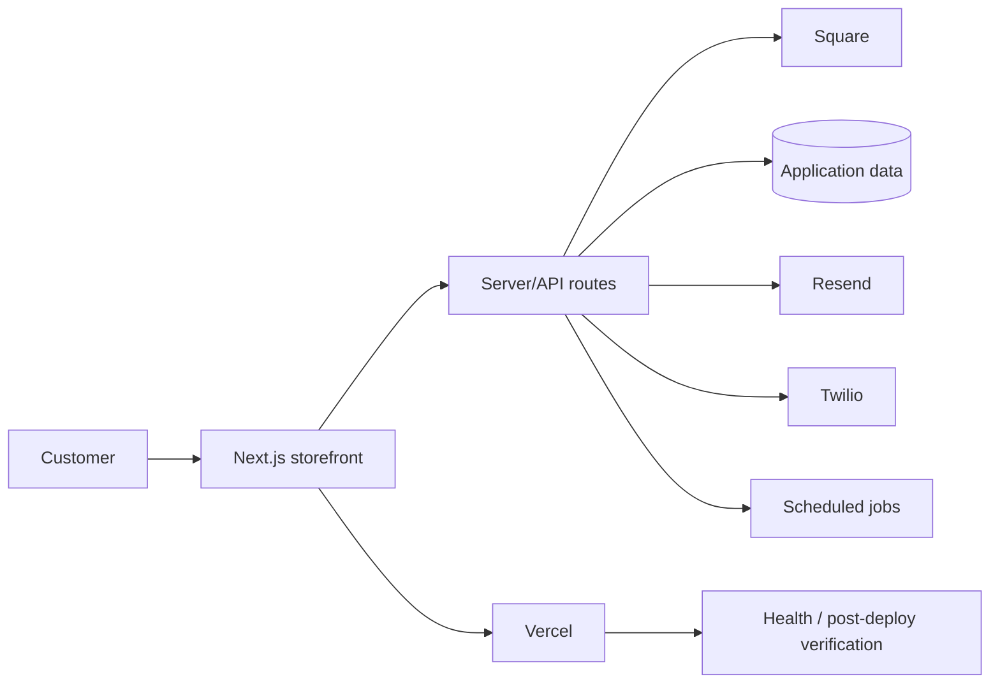

# Gratog — Taste of Gratitude Commerce Platform

Production commerce and operations software for **Taste of Gratitude**, an Atlanta market-first beverage and sea moss brand.

**Live production:** https://tasteofgratitude.shop


> **Status:** Production system. The public storefront returned HTTP 200 and the repository's production-health workflow had fresh passing runs on **October 7, 2026**. Payment, messaging, database, and administrative integrations still require valid production credentials and should be verified through their real transaction paths before any consequential release.

## Outcome

Gratog turns a market-based food and beverage operation into a repeatable digital sales system:

- weekly product discovery and preorder flows;
- market pickup selection and order handling;
- Square payment integration;
- scheduled customer campaigns and reminders;
- email and SMS integration surfaces;
- administrative and operational workflows;
- PWA/mobile support;
- deployment, monitoring, security, and test automation.

The repository is presented as **commercial production software**, not as a generic open-source starter.

## Architecture



## Verified repository baseline

| Area | Current repository evidence |
| --- | --- |
| Framework | Next.js 15 + TypeScript |
| UI | React 19 RC, Tailwind CSS, Radix UI |
| Commerce | Square SDK is present; Stripe libraries also exist in the dependency surface |
| Communications | Resend + Twilio |
| Data | MongoDB/Mongoose plus Redis/Upstash-related integrations in the current dependency surface |
| Observability | Sentry + dedicated health/performance workflows |
| Testing | Vitest, Playwright, route-governance, smoke/integration/payment-oriented workflow coverage |
| Delivery | Vercel configuration plus deployment/post-deploy workflows |

The code and executable configuration outrank older audit, phase, or completion documents when they conflict.

## Quality gates

The current package exposes these primary checks:

```bash
npm ci
npm run typecheck:ci
npm test
npm run check:route-governance
npm run build
```

Additional Playwright and production-path workflows live under `.github/workflows/`. A green deployment alone is not considered proof of commerce completion: checkout, callbacks/webhooks, order persistence, and customer-visible confirmation should be exercised when those paths change.

## Local development

### Requirements

- Node.js 22+ recommended for current Next.js tooling
- npm
- service credentials only for the integrations you intend to exercise

```bash
git clone https://github.com/wizelements/Gratog.git
cd Gratog
npm ci
cp .env.example .env.local
npm run dev
```

Do not copy production credentials into local files that may be committed.

## Configuration

Use `.env.example` as the configuration inventory. Production secrets belong in the deployment environment, not source control.

High-impact integrations include:

- Square;
- Resend;
- Twilio;
- application database/data services;
- monitoring/analytics services;
- cron/scheduled-job authorization.

## Security posture

See [SECURITY.md](SECURITY.md).

This repository contains dedicated security-scanning and hardening tests, but the existence of those files is **not** a blanket claim that every production route is secure. Security-sensitive changes should verify the real trust boundary involved: admin access, payment/webhook authenticity, customer input, scheduled jobs, secrets, and data access.

## Deployment

Primary production target: **Vercel**.

Normal release expectations:

1. install from the committed lockfile;
2. run the relevant static/test gates;
3. build successfully;
4. deploy through the intended environment;
5. verify the public route and changed user path;
6. for commerce changes, verify the real payment/order behavior;
7. retain evidence for failures and rollback.

## Known limitations / boundaries

- The repository contains historical reports and completion documents; they are not automatically current.
- Several third-party integrations cannot be fully reproduced without external accounts and secrets.
- The current React dependency is an RC build and should be evaluated during framework upgrades.
- Generated PWA preview assets are useful orientation, not proof that every visible production screen exactly matches them.
- No open-source license is granted by this repository. Public visibility does not grant reuse rights.

## Business value

Gratog demonstrates Cod3Black's ability to connect **customer experience → transaction → operations → follow-up → deployment evidence** in a real small-business environment rather than stopping at a brochure website.

---

**Maintained by Cod3Black Agency / wizelements**  
**Last portfolio verification:** October 7, 2026
